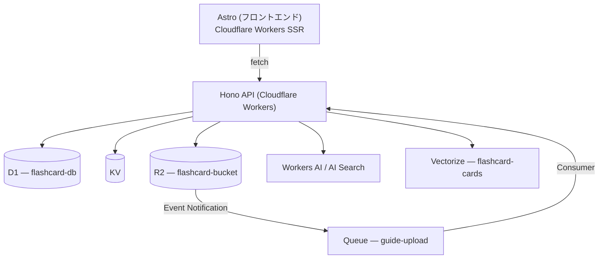

# Flashcard

資格試験合格を支援するフラッシュカードアプリ。SM-2ベースの間隔反復アルゴリズムとCloudflare AIを活用し、弱点を重点的に学習できる。

> **Status: 設計段階** — 現在はAPI雛形のみ実装済み。以下は完成時の設計を示す。

## 技術スタック

| レイヤー | 技術 |
|---|---|
| フロントエンド | Astro + [@cloudflare/kumo](https://www.npmjs.com/package/@cloudflare/kumo) (React, Tailwind) |
| API | [Hono](https://hono.dev) on Cloudflare Workers |
| データストア | D1 (SQLite), KV (セッション/キャッシュ), R2 (試験ガイド/画像/メディア) |
| AI | Workers AI, AI Gateway, Vectorize, AI Search |
| 非同期処理 | Queues (試験ガイド解析パイプライン) |
| 認証 | 未定 (低優先度) |

## アーキテクチャ



**APIエンドポイント:**

| メソッド | パス | 概要 |
|---|---|---|
| GET | `/api/decks` | デッキ一覧 |
| GET | `/api/decks/:id` | デッキ詳細 |
| POST | `/api/review/next` | 次の出題 |
| POST | `/api/review/answer` | 回答送信 |
| GET | `/api/review/stats` | 学習統計 |
| POST | `/api/ai/explain` | AI解説 |
| POST | `/api/ai/search` | 類似問題 |
| POST | `/api/ai/weakness` | 弱点分析 |
| POST | `/api/feedback` | 報告送信 |
| GET | `/api/feedback` | 報告一覧 |
| POST | `/api/feedback/:id/run` | ファクトチェック |
| POST | `/api/feedback/:id/resolve` | 管理者判断 |
| POST | `/api/cards/judge` | 品質バッチ評価 |
| POST | `/api/generate` | 問題生成 |
| GET | `/api/exams` | 試験一覧 |
| GET | `/api/exams/:id/spec` | 試験仕様 |

## SM-2 間隔反復アルゴリズム

回答時にユーザーが自己評価 (0-5) を入力し、次回出題タイミングを決定する。

| 評価 | 意味 |
|---|---|
| 5 | 完璧に思い出せた |
| 4 | 少し迷ったが正解 |
| 3 | かなり迷ったが正解 |
| 2 | 不正解だが見て思い出した |
| 1 | 不正解、見ても曖昧 |
| 0 | 完全に忘れていた |

```
if quality >= 3:
  if repetitions == 0: interval = 1
  elif repetitions == 1: interval = 6
  else: interval = round(interval * easiness)
  repetitions += 1
else:
  repetitions = 0
  interval = 1

easiness = max(1.3, easiness + 0.1 - (5 - quality) * (0.08 + (5 - quality) * 0.02))
next_review = today + interval days
```

## 開発コマンド

```bash
pnpm install          # 依存インストール
pnpm run dev          # ローカル開発サーバー起動
pnpm run deploy       # Cloudflare Workersへデプロイ
pnpm run cf-typegen   # Cloudflareバインディングの型生成
```

## 設計ドキュメント

詳細な設計は `docs/` を参照。

| ドキュメント | 内容 |
|---|---|
| [docs/schema.md](docs/schema.md) | D1テーブル設計、KV・R2 の設計 |
| [docs/ai-features.md](docs/ai-features.md) | AI機能（解説生成、類似検索、弱点分析、フィードバックパイプライン） |
| [docs/generation-pipeline.md](docs/generation-pipeline.md) | 問題生成パイプライン（R2 → Queue → AI解析 → D1） |
| [docs/testing.md](docs/testing.md) | テスト戦略・設定・サンプルコード |
| [docs/claude-code-guide.md](docs/claude-code-guide.md) | Claude Code 開発ガイドライン |
