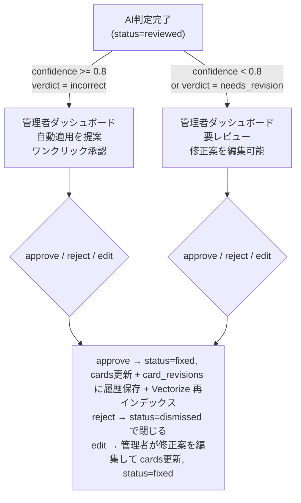

# AI機能

## 不正解時の解説生成 (Workers AI + AI Gateway)

不正解のカードに対してAIが解説・ヒントを生成する。AI Gatewayを経由してキャッシュ・レート制限・ログを管理。

```jsonc
// wrangler.jsonc
{
  "ai": { "binding": "AI" }
}
```

```ts
// Workers AI呼び出し (AI Gateway経由)
// 正解テキストは card_options + card_answers を結合して構築する
// (cards テーブルに answer カラムはない — schema.md 参照)
const correctAnswer = await formatCorrectAnswer(c.env.DB, card.id, card.type)

const response = await c.env.AI.run(
  '@cf/meta/llama-3.3-70b-instruct-fp8-fast',
  {
    messages: [
      { role: 'system', content: 'あなたは資格試験の講師です。不正解の問題を解説してください。' },
      { role: 'user', content: `問題: ${card.question}\n正解: ${correctAnswer}` }
    ]
  },
  { gateway: { id: 'flashcard-gw' } }
)
```

## 類似問題検索 (Vectorize)

問題文をWorkers AIでベクトル化してVectorizeに格納。苦手な問題に類似した問題を検索し、弱点分野を集中的に学習できるようにする。

```jsonc
// wrangler.jsonc
{
  "vectorize": [
    { "binding": "VECTORIZE", "index_name": "flashcard-cards" }
  ]
}
```

```bash
# インデックス作成
npx wrangler vectorize create flashcard-cards --dimensions=768 --metric=cosine
```

```ts
// ベクトル化 + 検索
const embedding = await c.env.AI.run('@cf/baai/bge-base-en-v1.5', {
  text: [card.question]
})

const similar = await c.env.VECTORIZE.query(embedding.data[0], {
  topK: 5,
  returnMetadata: 'all',
  filter: { deck_id: deckId }
})
```

## 弱点分析

学習記録から正答率の低いタグ・分野を特定し、Workers AIで学習アドバイスを生成する。

## フィードバック & 品質改善パイプライン

LLMで生成した問題には誤りが含まれる可能性がある。**ユーザー報告 → AIファクトチェック (LLM-as-a-Judge) → 管理者レビュー (Human-in-the-Loop)** の3段階で問題品質を継続的に改善する。

**ステータス遷移 (feedbacks.status):**

```
pending → checking → reviewed → fixed | dismissed
                                  ↑ approve/edit   ↑ reject
```

各状態の定義は [schema.md の feedbacks テーブル](schema.md) を参照。

### 1. ユーザーからのフィードバック報告

学習画面のカードに「問題を報告」ボタンを表示。種別選択 + 自由記述で送信。

| type | 意味 |
|---|---|
| `incorrect_answer` | 正解が間違っている |
| `ambiguous` | 問題文が曖昧・複数解釈可能 |
| `outdated` | 情報が古い（仕様変更等） |
| `other` | その他 |

### 2. AIファクトチェック (LLM-as-a-Judge)

フィードバック受信後、AIが自動でファクトチェックを実行する。ステータス遷移: `pending` → `checking` → `reviewed`（schema.md の feedbacks テーブル参照）。

```
POST /api/feedback/:id/run
  (status: pending → checking)

  Step 1: AI Searchで公式ドキュメント・教材を検索
  │  env.AI.autorag('flashcard-rag').search({ query })
  │
  Step 2: LLM-as-a-Judge — 複数観点で評価
  │  Workers AIに以下を判定させる:
  │  ┌──────────────────────────────────────────┐
  │  │ 評価観点           │ スコア (0.0-1.0)    │
  │  ├──────────────────────────────────────────┤
  │  │ factual_accuracy   │ 事実の正確性         │
  │  │ answer_correctness │ 正解の妥当性         │
  │  │ clarity            │ 問題文の明確さ       │
  │  │ relevance          │ 試験範囲との関連性   │
  │  └──────────────────────────────────────────┘
  │
  Step 3: 総合判定 + 修正提案を生成
  │  (status: checking → reviewed)
     confidence >= 0.8 → 高確信（自動適用候補）
     confidence <  0.8 → 低確信（管理者レビュー必須）
```

```ts
// LLM-as-a-Judge プロンプト
const judgePrompt = `あなたは資格試験問題の品質審査官です。
以下の問題を参考資料に基づいて評価し、厳密にJSON形式で返してください。

{
  "scores": {
    "factual_accuracy": 0.0-1.0,
    "answer_correctness": 0.0-1.0,
    "clarity": 0.0-1.0,
    "relevance": 0.0-1.0
  },
  "overall_confidence": 0.0-1.0,
  "verdict": "correct" | "incorrect" | "needs_revision",
  "reason": "判定理由（参考資料の該当箇所を引用）",
  "suggestion": {
    "question": "修正後の問題文（変更不要ならnull）",
    "answer": "修正後の正解テキスト（変更不要ならnull）"
  }
}
// ※ suggestion.answer は feedbacks.ai_suggested_answer に保存される
//   人間が可読なテキスト形式。実際の cards 更新時に card_options/card_answers に変換する`
```

### 3. Human-in-the-Loop (管理者レビュー)

AIの判定結果は必ず管理者が確認してから問題に反映する。ただし高確信の修正は自動適用を許可する閾値を設けられる。



**管理者ダッシュボード画面:**
- フィードバック一覧（ステータスでフィルタ）
- AI判定の詳細表示（各観点のスコア + 理由 + 引用元）
- 修正案のdiff表示（現在の問題 ↔ AI提案）
- 承認 / 却下 / 手動編集の3アクション
- カード改訂履歴の閲覧

### 4. LLM-as-a-Judge による投入時の品質ゲート

問題を投入する際にも、LLM-as-a-Judgeで事前品質チェックを実行できる。`cards.quality_score` に評価結果を保存し、スコアが低い問題は出題対象から除外する。

```ts
// 問題投入後のバッチ品質評価
// POST /api/cards/judge - デッキ内の未評価カードを一括判定
app.post('/api/cards/judge', async (c) => {
  const cards = await c.env.DB.prepare(
    'SELECT * FROM cards WHERE quality_score IS NULL LIMIT 10'
  ).all()

  for (const card of cards.results) {
    const correctAnswer = await formatCorrectAnswer(c.env.DB, card.id, card.type)
    const sources = await c.env.AI.autorag('flashcard-rag').search({
      query: `${card.question} ${correctAnswer}`,
      max_num_results: 3,
    })

    const judge = await c.env.AI.run(
      '@cf/meta/llama-3.3-70b-instruct-fp8-fast',
      { messages: [{ role: 'system', content: judgePrompt }, { role: 'user', content: `...` }] },
      { gateway: { id: 'flashcard-gw' } }
    )

    await c.env.DB.prepare(
      'UPDATE cards SET quality_score = ?, quality_note = ? WHERE id = ?'
    ).bind(judge.overall_confidence, judge.reason, card.id).run()
  }
})
```

出題時は `quality_score >= 0.6` のカードのみを対象にする（閾値は調整可能）。

## AI Search (マネージドRAG)

データソース（R2上の教材・問題集PDF等）を自動インデックス化し、RAGベースの質問応答を提供する。チャンク分割・ベクトル化・検索・生成のパイプラインをフルマネージドで実行。R2サブスクリプションが前提条件。ダッシュボードの AI > AI Search から作成。

Workers Bindingからは `env.AI.autorag()` 経由でアクセスする。AI bindingを共用するため追加のbinding設定は不要。

```ts
// 検索 + AI生成 (aiSearch)
const answer = await c.env.AI.autorag('flashcard-rag').aiSearch({
  query: 'TCPの3ウェイハンドシェイクについて説明して',
  model: '@cf/meta/llama-3.3-70b-instruct-fp8-fast',
  rewrite_query: true,
  max_num_results: 3,
  ranking_options: { score_threshold: 0.3 },
  reranking: { enabled: true, model: '@cf/baai/bge-reranker-base' },
  stream: true,
})

// 検索のみ (search) - 生成なし
const results = await c.env.AI.autorag('flashcard-rag').search({
  query: 'サブネットマスクの計算',
  max_num_results: 5,
})
```

**制約:**
- 個別ファイル: 最大4MB
- カスタムメタデータ: 最大5フィールド
- 自動同期: 6時間ごと（手動は30秒間隔）
- 類似キャッシュ: 30日で期限切れ
