# 問題生成パイプライン

```mermaid
graph TD
  subgraph "① アップロード → 自動解析"
    Upload["試験ガイド (.md/.pdf)"] --> R2["R2 guides/"]
    R2 -- R2 Event Notification --> Queue["Queue: guide-upload"]
    Queue -- Consumer Worker --> Analyze["② 試験ガイド解析<br/>Workers AI で<br/>出題形式・配点・<br/>トピック構成を抽出"]
    Analyze --> Store["R2 specs/ に仕様保存<br/>D1 exams に登録"]
  end

  subgraph "③ 問題生成"
    Request["この試験について10問追加して"] --> Generate["POST /api/generate"]
    Generate --> Step1["1. D1 から試験仕様"]
    Step1 --> Step2["2. AI Search で公式ドキュメント検索"]
    Step2 --> Step3["3. Workers AI で仕様に沿って問題生成"]
    Step3 --> Step4["4. LLM-as-a-Judge 品質チェック"]
    Step4 --> Step5["5. D1 に保存"]
  end
```



## R2 バケット構成

バケット構成の正規定義は [schema.md の R2 セクション](schema.md#r2) を参照。パイプラインが使用するプレフィックス:

- `guides/{exam_id}/guide.md` — 試験ガイド (入力)。アップロード時に Event Notification が発火
- `specs/{exam_id}/spec.md` — 解析済み試験仕様 (Consumer Worker が自動生成)
- `media/cards/{card_id}/{filename}` — 問題の画像・図表

## wrangler.jsonc (パイプライン用バインディング)

```jsonc
{
  "r2_buckets": [
    { "binding": "BUCKET", "bucket_name": "flashcard-bucket" }
  ],
  "queues": {
    "producers": [
      { "queue": "guide-upload", "binding": "GUIDE_QUEUE" }
    ],
    "consumers": [
      { "queue": "guide-upload", "max_batch_size": 1, "max_batch_timeout": 30 }
    ]
  },
  "ai": { "binding": "AI" }
}
```

```bash
# R2 イベント通知の設定 (guides/ プレフィックスのみ)
npx wrangler r2 bucket notification create flashcard-bucket \
  --event-type object-create \
  --queue guide-upload \
  --prefix "guides/"
```

## Step 1: 試験ガイドのアップロードと解析

試験ガイドを R2 にアップロードすると、Queue 経由で Consumer Worker が自動起動し、試験仕様を抽出する。

```ts
// Consumer Worker: 試験ガイド解析
export default {
  async queue(batch, env) {
    for (const message of batch.messages) {
      const event = message.body as R2EventNotification
      const key = event.object.key  // 'guides/snowpro-core/guide.md'

      // 1. R2 からガイドを読み取り
      const guide = await env.BUCKET.get(key)
      const text = await guide.text()

      // 2. Workers AI で試験仕様を抽出
      const spec = await env.AI.run(
        '@cf/meta/llama-3.3-70b-instruct-fp8-fast',
        {
          messages: [
            {
              role: 'system',
              content: `あなたは試験分析の専門家です。試験ガイドから以下を抽出し、Markdown形式で出力してください:
## 試験概要
- 試験名、提供元、問題数、合格ライン、試験時間

## 出題形式
各形式を箇条書き (single_select, multi_select, fill_blank, matching, ordering, hotspot, domc のいずれかに分類)

## トピック構成
| トピック名 | 配点比率 | 主要キーワード |
形式: テーブル

## 公式ドキュメントURL
学習に必要なURLを列挙`
            },
            { role: 'user', content: text }
          ]
        },
        { gateway: { id: 'flashcard-gw' } }
      )

      // 3. 仕様を R2 に保存
      const examId = key.split('/')[1]  // 'snowpro-core'
      await env.BUCKET.put(`specs/${examId}/spec.md`, spec.response)

      // 4. D1 に exams, exam_topics, exam_card_types を登録
      //    (spec の構造化データをパースして INSERT)
      await registerExam(env.DB, examId, spec)

      message.ack()
    }
  }
}
```

## Step 2: 問題生成

APIまたは管理画面から「この試験について N 問追加して」とリクエストする。

```ts
// POST /api/generate
// body: { exam_id: 'snowpro-core', count: 10, topic_id?: string, type?: string }
app.post('/api/generate', async (c) => {
  const { exam_id, count, topic_id, type } = await c.req.json()

  // 1. 試験仕様を取得
  const exam = await c.env.DB.prepare(
    'SELECT * FROM exams WHERE id = ?'
  ).bind(exam_id).first()

  const spec = await c.env.BUCKET.get(exam.spec_key)
  const specText = await spec.text()

  // 2. トピック情報を取得 (指定があれば絞り込み)
  const topics = await c.env.DB.prepare(
    topic_id
      ? 'SELECT * FROM exam_topics WHERE exam_id = ? AND id = ?'
      : 'SELECT * FROM exam_topics WHERE exam_id = ?'
  ).bind(...(topic_id ? [exam_id, topic_id] : [exam_id])).all()

  // 3. 使用する問題形式を取得
  const types = await c.env.DB.prepare(
    type
      ? 'SELECT ct.* FROM card_types ct WHERE ct.id = ?'
      : `SELECT ct.* FROM card_types ct
         JOIN exam_card_types ect ON ct.id = ect.card_type_id
         WHERE ect.exam_id = ?`
  ).bind(type || exam_id).all()

  // 4. AI Search で公式ドキュメントから関連コンテンツを検索
  const sources = await c.env.AI.autorag('flashcard-rag').search({
    query: topics.results.map(t => t.name).join(' '),
    max_num_results: 10,
  })

  // 5. Workers AI で問題を生成
  const generated = await c.env.AI.run(
    '@cf/meta/llama-3.3-70b-instruct-fp8-fast',
    {
      messages: [
        {
          role: 'system',
          content: `あなたは資格試験の問題作成者です。以下の制約に従って問題を生成してください。

## 試験仕様
${specText}

## 使用する問題形式
${types.results.map(t => `- ${t.id}: ${t.label} (${t.description})`).join('\n')}

## ルール
- 参考資料に基づいた事実に正確な問題を作成すること
- 各問題に出典URLを含めること
- 問題ごとに以下のJSONを出力:
  { "type", "topic_id", "question", "explanation", "source_url", "options": [...], "answers": [...] }
- options の各要素: { "position", "label", "body", "group_name"? }
- answers の各要素: { "option_position"?, "text_value"?, "sort_order"?, "region"? }
- ${count}問生成すること
- トピックの配点比率に応じて問題数を配分すること`
        },
        {
          role: 'user',
          content: `## 対象トピック\n${topics.results.map(t => `- ${t.name} (${(t.weight * 100).toFixed(0)}%)`).join('\n')}\n\n## 参考資料\n${JSON.stringify(sources.data)}`
        }
      ]
    },
    { gateway: { id: 'flashcard-gw' } }
  )

  // 6. パースして D1 に保存 + LLM-as-a-Judge で品質チェック
  const cards = parseGeneratedCards(generated.response)
  const saved = await saveAndJudgeCards(c.env, exam_id, cards)

  return c.json({ generated: saved.length, cards: saved })
})
```

## Step 3: 手動投入 (wrangler)

LLM生成に加え、手動でのデータ投入も引き続きサポート。

```bash
# D1データベース作成
npx wrangler d1 create flashcard-db

# スキーマ適用
npx wrangler d1 execute flashcard-db --local --file=./seeds/schema.sql

# 試験ガイドをR2にアップロード (→ 自動解析トリガー)
npx wrangler r2 object put flashcard-bucket/guides/snowpro-core/guide.md \
  --file=./guides/snowpro-core.md

# 手動で問題を投入する場合
npx wrangler d1 execute flashcard-db --local --file=./seeds/deck-snowpro-core.sql
npx wrangler d1 execute flashcard-db --remote --file=./seeds/deck-snowpro-core.sql
```
